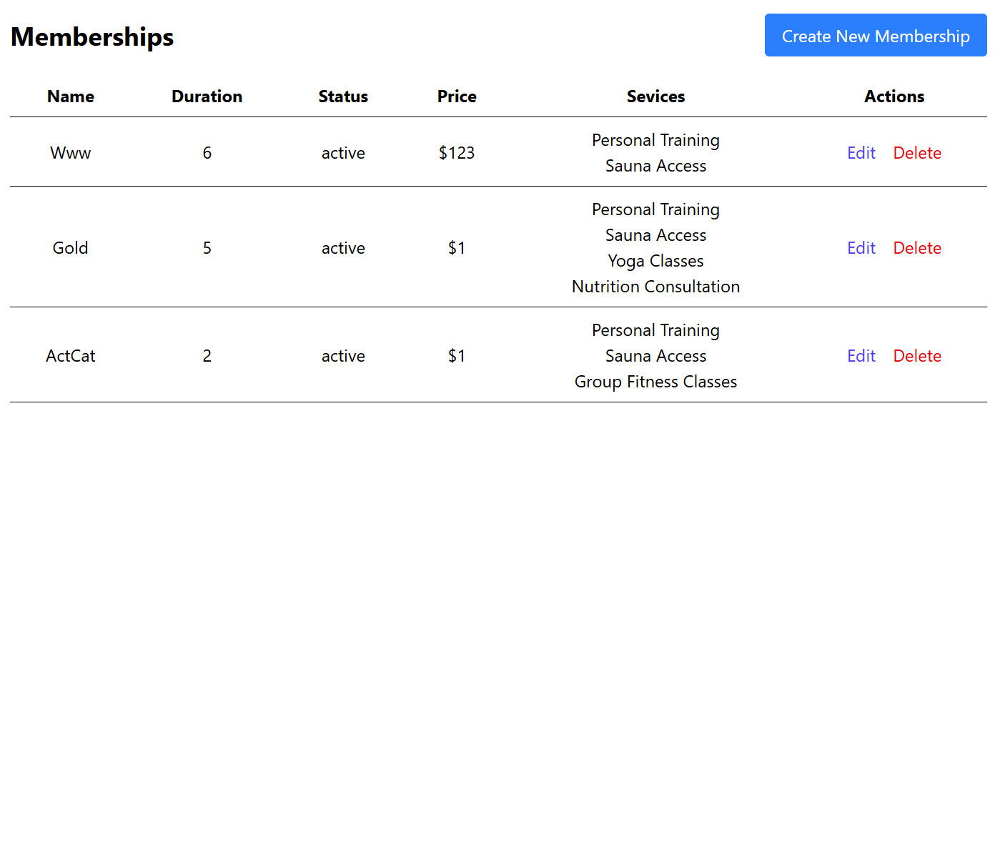
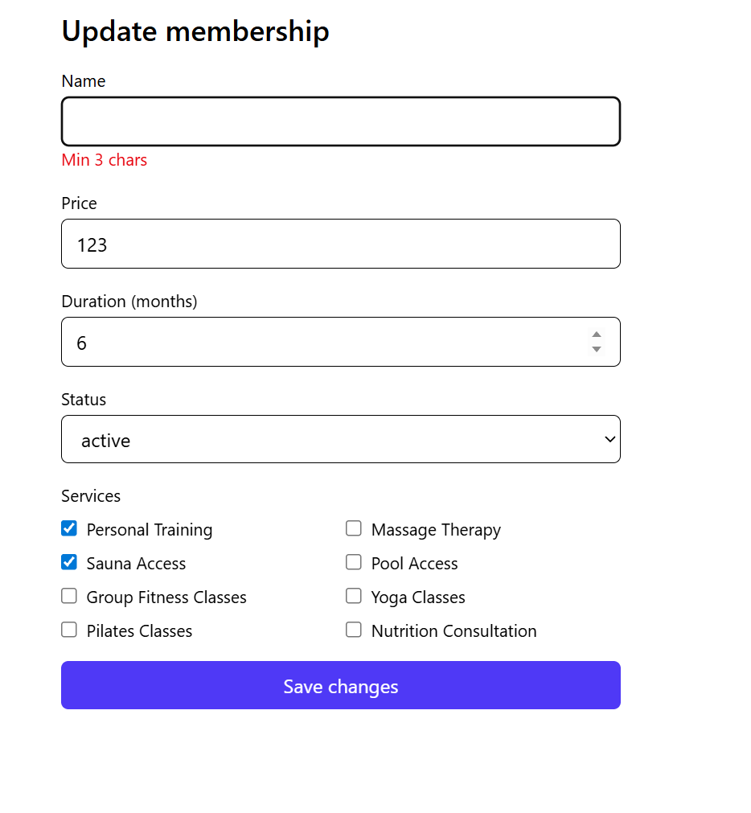
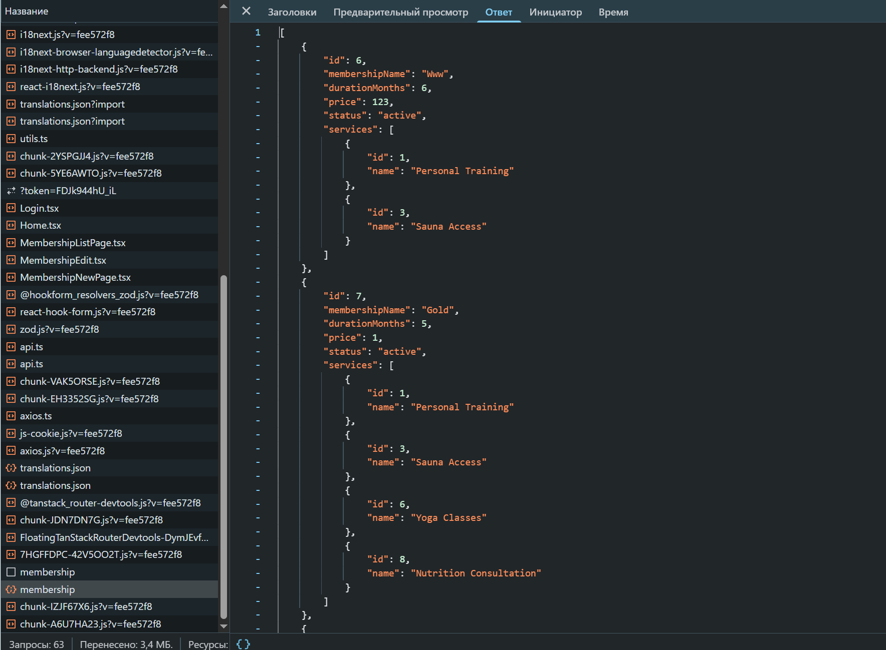
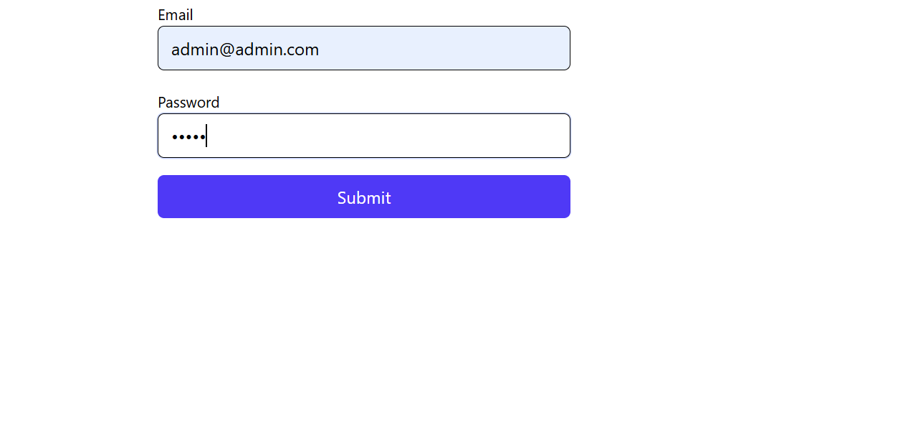

# KPZ Lab – Frontend

## 📌 Короткий опис реалізованого функціоналу

У проєкті реалізовано повноцінний CRUD для сутності **Membership**, а також зв’язок Many-to-Many із сутністю **Service**.  
Розроблено Frontend (React + TanStack Query + TanStack Router + Zod + Axios).

### Реалізовано:

- Отримання списку абонементів
- Перегляд абонемента по ID
- Створення абонемента
- Оновлення абонемента
- Прив’язка сервісів до абонемента
- Валідація через Zod (на фронтенді) та middleware (на бекенді)
- Завантаження списку даних через TanStack Query із індикатором `isLoading`
- Відображення помилок валідації
- HTTP-запити через Axios
- Protected routes на TanStack Router

---

### 🔹 Axios конфігурація

````ts
const apiClient = axios.create({
	baseURL: import.meta.env.VITE_API_BASE_URL + "/v1/",
	headers: {
		"Content-Type": "application/json",
	},
});


const token = Cookies.get("token");
if (token) {
	apiClient.defaults.headers.common["Authorization"] = `${token}`;
}


apiClient.interceptors.response.use(
	(response) => response,
	(error) => {


		console.error("API Error:", error.response?.data || error.message);

		if (error.response.status === 401) {
			window.location.href = "/login";
		}

		return Promise.reject(error);
	}
);


---

### 🔹 Хук для TanStack Query (GET)

```ts

const getMemberships = async (): Promise<Membership[]> => {
	const response = await apiClient.get("/membership");
	return response.data;
};

export const useMemberships = () =>
	useQuery<Membership[]>({
		queryKey: ["memberships"],
		queryFn: getMemberships,
	});
````

---

### 🔹 Zod схема (Frontend)

```ts
const schema = z.object({
	name: z.string().min(3, "Min 3 chars"),
	price: z.number("Must be a number").positive(),
	duration_months: z.number("Must be a number").int().min(1),
	status: z.string().nullable().optional(),
	serviceIds: z.array(z.number()).default([]).optional(),
});
```

---

### 📋 1. Список сутностей (Memberships)



### ❌ 2. Форма із помилками валідації Zod



### 🌐 3. Network вкладка DevTools



### 🔐 4.Сторінка логіну



---

## 🚀 Запуск Frontend

```sh
npm install
npm run dev
```

---

## 🔚 Висновки

✔ Реалізовано повноцінний CRUD  
✔ Frontend і Backend синхронізовані за типами  
✔ Валідація на обох шарах  
✔ Many-to-Many працює  
✔ Підтверджено HTTP-запити через Network

---
